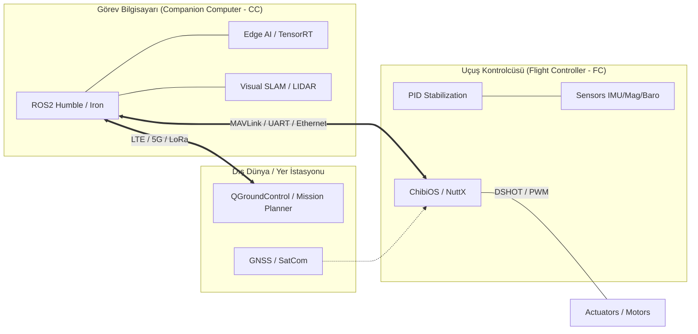

# 🛸 UAV Systems Architecture: Engineering Blueprint `v2.5-Sovereign`

[](https://github.com/arch-yunus/uav-systems-architecture)
[](https://docs.ros.org/en/humble/index.html)
[](https://www.nvidia.com/en-us/autonomous-machines/embedded-systems/)

> **"Mühendislik, imkansızı otonom hale getirme sanatıdır."**

Bu depo, modern İHA sistemleri için uçtan uca otonomi, GNC (Guidance, Navigation, Control) ve Edge-AI mimarisi için kesin teknik referanstır.

---

## 🏛️ Mimari Vizyon: "Sovereign Intelligence"

ARGUS ekosistemi, bir İHA'nın sadece "uçmasını" değil, **çatışmalı ve GPS-denied ortamlarda görev icra edebilen bir hava robotu** haline gelmesini sağlayan tüm sistem bileşenlerini kapsar.

### 🧩 Temel Sütunlar
1. **Düşük Gecikmeli Kontrol (Low-Latency Loop):** 400Hz+ PID döngüleri.
2. **Siber-Asabiyet (Resilient Comms):** Şifreli ve kesintisiz MAVLink/DDS akışı.
3. **Uçta Akıl (Edge Intelligence):** NVIDIA Orin üzerinde gerçek zamanlı SLAM ve Nesne Tespiti.

---

## 🏗️ Sistem Topolojisi (Mantıksal & Fiziksel)



---

## 🥞 Yazılım Katmanları (The Mission Stack)

| Katman | Fonksiyon | Teknoloji |
| :--- | :--- | :--- |
| **Uygulama** | Otonom Görev Yönetimi | ROS2 Action Servers, Python/C++ |
| **Zekâ** | Bilgisayarlı Görü & SLAM | OpenVINO, TensorRT, RTAB-Map |
| **Middleware** | Veri Dağıtım Servisi | FastDDS, CycloneDDS, micro-ROS |
| **Kontrol** | Stabilizasyon & Donanım | ArduPilot, PX4, STM32 HAL |

---

## 🚀 Hızlı Başlangıç (Quickstart)

Tüm geliştirme ortamını (ROS2, MAVLink SDK, OpenCV) tek komutla ayağa kaldırın:

```bash
chmod +x scripts/bootstrap.sh
./scripts/bootstrap.sh --install-all
```

---

**arch-yunus tarafından ⚔️ ile geliştirilmiştir.**

---

## 📄 Lisans

Bu proje [MIT Lisansı](LICENSE) altında lisanslanmıştır. Sistem mimarileri paylaşıldıkça güçlenir, açık kaynak komünitesine katkıda bulunmaktan çekinmeyin.
```