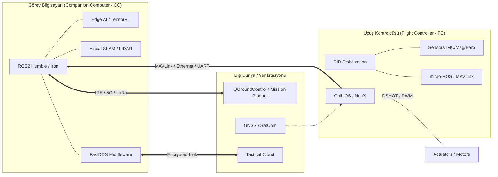

# 🛸 UAV Systems Architecture: Engineering Blueprint `v2.5-Sovereign`

[](https://github.com/arch-yunus/uav-systems-architecture)
[](https://docs.ros.org/en/humble/index.html)
[](https://www.nvidia.com/en-us/autonomous-machines/embedded-systems/)

> **"Mühendislik, imkansızı otonom hale getirme sanatıdır."**

Bu depo, modern İHA sistemleri için uçtan uca otonomi, GNC (Guidance, Navigation, Control) ve Edge-AI mimarisi için kesin teknik referanstır. Sovereign Intelligence mimarisi, en zorlu sahalarda dahi kesintisiz karar verme kabiliyeti üzerine inşa edilmiştir.

---

## 🏛️ Mimari Vizyon: "Sovereign Intelligence"

ARGUS ekosistemi, bir İHA'nın sadece "uçmasını" değil, **çatışmalı ve GPS-denied ortamlarda görev icra edebilen bir hava robotu** haline gelmesini sağlayan tüm sistem bileşenlerini kapsar. Bu vizyon, teknik bağımsızlık ve algoritmik üstünlük üzerine kuruludur.

### 🧩 Temel Sütunlar
1. **Düşük Gecikmeli Kontrol (Low-Latency Loop):** 400Hz+ PID döngüleri ve gerçek zamanlı RTOS katmanı.
2. **Siber-Asabiyet (Resilient Comms):** Şifreli, çok kanallı ve DDS tabanlı veri sürekliliği.
3. **Uçta Akıl (Edge Intelligence):** NVIDIA Orin üzerinde doğrudan GPU/NPU kullanarak gerçek zamanlı SLAM, Nesne Tespiti ve Kaçınma.

---

## 🏗️ Sistem Topolojisi (Mantıksal & Fiziksel)

Sistem, iş yükünü "Kritik Kontrol" ve "Gelişmiş Görev Mantığı" olarak ikiye bölen dağıtık bir yapıya sahiptir.



---

## 🧠 GNC ve Otonomi Döngüsü

İHA'nın karar verme süreci, iç içe geçmiş üç ana kontrol döngüsünden oluşur:

### 1. Rehberlik (Guidance)
Görev bilgisayarındaki ROS2 düğümleri (Örn: Nav2), dinamik engelleri ve hedef koordinatlarını analiz ederek optimal rotayı (trajectory) hesaplar.
- **Teknoloji:** A*, RRT*, Model Predictive Control (MPC).

### 2. Seyrüsefer (Navigation)
Sensör füzyonu (EKF) kullanılarak cihazın uzaydaki konumu ve yönelimi (state estimation) milimetrik hassasiyetle belirlenir.
- **Teknoloji:** Visual-Inertial Odometry (VIO), GNSS-RTK, LiDAR SLAM.

### 3. Kontrol (Control)
FC üzerindeki düşük seviyeli PID döngüleri, rehberlik katmanından gelen komutları motor sinyallerine (PWM/DSHOT) dönüştürür.
- **Hız:** 400Hz - 8kHz arası çalışma frekansı.

---

## 🥞 Yazılım Katmanları (The Mission Stack)

| Katman | Fonksiyon | Teknoloji |
| :--- | :--- | :--- |
| **Uygulama** | Otonom Görev Yönetimi | ROS2 Action Servers, Behavior Trees |
| **Zekâ** | Bilgisayarlı Görü & SLAM | OpenVINO, TensorRT, RTAB-Map |
| **Middleware** | Veri Dağıtım Servisi | FastDDS (Hardened Config), micro-ROS |
| **Kontrol** | Stabilizasyon & Donanım | ArduPilot, PX4 Autopilot, STM32 HAL |

---

## 👁️ Edge AI Optimizasyon İş Akışı

Edge cihazlarda (Jetson/Orin) saniyede 30+ FPS ile analiz yapmak için şu yol izlenir:
1. **Eğitim:** PyTorch/TensorFlow üzerinde model eğitimi.
2. **Kuantizasyon:** FP32 modelin FP16 veya INT8 formatına dönüştürülmesi.
3. **Optimizasyon:** NVIDIA TensorRT ile donanıma özel kernel optimizasyonu.
4. **Entegrasyon:** `ros2_vision` düğümü ile verinin DDS hattına aktarılması.

---

## 🚀 Hızlı Başlangıç (Quickstart)

Tüm mühendislik ortamını (ROS2, MAVLink SDK, OpenCV, TensorRT) tek komutla ayağa kaldırın:

```bash
chmod +x scripts/bootstrap.sh
./scripts/bootstrap.sh --install-all
```

---

## 🤝 Katkıda Bulunma
Sovereign Intelligence, açık kaynak komünitesinin gücüyle gelişir. Kritik sistem mimarileri, GNC algoritmaları veya güvenlik yamaları için Pull Request göndermekten çekinmeyin.

**arch-yunus tarafından ⚔️ ile geliştirilmiştir.**

---

## 📄 Lisans
Bu proje [MIT Lisansı](LICENSE) altında lisanslanmıştır. Bilgiyi özgürce kullanabilir ve gökyüzünün hakimi olabilirsiniz.
```