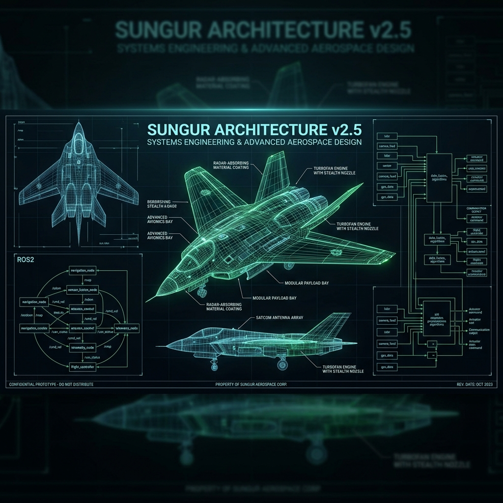
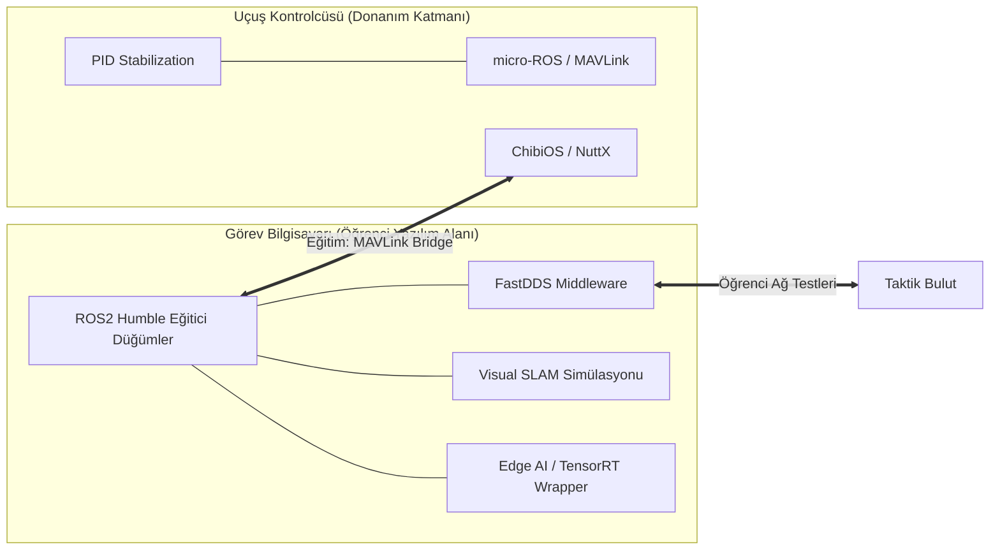

# 🛸 SUNGUR Akademi: Otonom Sistemler Laboratuvarı `v3.0-Eğitim`

[](https://github.com/arch-yunus/uav-systems-architecture)
[](https://docs.ros.org/en/humble/index.html)
[](https://www.nvidia.com/en-us/autonomous-machines/embedded-systems/)

> **"Gerçek bir mühendis kodu ezberlemez, sistemin fiziğini kodlar."**

**SUNGUR Otonom Sistemler Laboratuvarı**'na hoş geldiniz. Bu depo, SUNGUR İHA Mühendisliği Akademisi'nin yazılım ve algoritma uygulama merkezidir. Öğrencilerin uçtan uca otonomi, GNC (Guidance, Navigation, Control) ve Edge-AI kavramlarını pratik olarak deneyimleyebileceği eğitici bir "Sandbox" olarak tasarlanmıştır.

---

## 🏛️ Eğitim Vizyonu: "Deneyerek Öğren"

Amacımız, öğrencilere sadece teorik bilgi vermek değil; gerçek dünyada çalışan, endüstriyel standartlardaki algoritmaları (ROS2, TensorRT, FastDDS) kendi bilgisayarlarında derleyip simüle edebilecekleri bir açık kaynaklı laboratuvar sunmaktır.

### 🧩 İncelenecek Temel Sütunlar
1. **Düşük Gecikmeli Kontrol (Low-Latency Loop):** Öğrenciler, PID kontrolörlerin uçuş dinamiğine etkisini `pid_controller.hpp` üzerinden inceleyebilir.
2. **Haberleşme Mimarisi:** DDS tabanlı veri sürekliliği ve QoS (Quality of Service) ayarlarının nasıl yapıldığı `fastdds_profile.xml` ile test edilebilir.
3. **Uçta Akıl (Edge Intelligence):** NVIDIA Orin üzerinde çalışan TensorRT tabanlı otonom karar verme döngüleri.

---

## 🏗️ Sistem Topolojisi (Eğitim Modeli)

Sistem, öğrencilerin "Kritik Kontrol" ve "Gelişmiş Görev Mantığı" ayrımını kavrayabilmesi için dağıtık bir yapıda kurgulanmıştır.



---

## 🧠 GNC ve Otonomi Döngüsü (Ders Konuları)

Öğrencilerin kodları inceleyerek kavraması beklenen üç ana döngü:

### 1. Rehberlik (Guidance)
ROS2 düğümleri (Örn: `trajectory_generator.cpp`) ile dinamik engellerin analizi ve optimal rota (trajectory) planlaması.
- **Kavramlar:** A*, RRT*, Model Predictive Control (MPC).

### 2. Seyrüsefer (Navigation)
Sensör füzyonu (EKF) kullanılarak cihazın konumunun tahmin edilmesi (state estimation).
- **Kavramlar:** Visual-Inertial Odometry (VIO), GNSS-RTK.

### 3. Kontrol (Control)
Düşük seviyeli PID döngülerinin, rehberlik katmanından gelen komutları motor sinyallerine dönüştürmesi.
- **Kavramlar:** İleri beslemeli (Feed-forward) kontrol, PID Tuning.

---

## 🥞 Yazılım Katmanları (Akademik Yığın)

| Katman | İncelenecek Dosyalar | Akademik Odak |
| :--- | :--- | :--- |
| **Uygulama** | `mission_manager.cpp` | State Machine (Durum Makinesi) tasarımı. |
| **Zekâ** | `tensorrt_wrapper.py` | Modellerin Edge cihazlara optimize edilmesi. |
| **Middleware** | `heartbeat_monitor.py` | Dağıtık sistemlerde hata toleransı (Failsafe). |
| **Kontrol** | `pid_controller.hpp` | Anti-windup ve saturasyon sınırları. |

---

## 🚀 Laboratuvarı Başlatma (Quickstart)

Tüm eğitim ortamını (ROS2, MAVLink SDK, OpenCV) tek komutla ayağa kaldırın:

```bash
chmod +x scripts/bootstrap.sh
./scripts/bootstrap.sh --install-all
```

**Docker ile Simülasyon:**
```bash
docker-compose up -d
```

---

## 🤝 Öğrenci Katkıları
SUNGUR Akademisi, açık kaynak felsefesiyle büyür. Öğrenciler, laboratuvarda geliştirdikleri yeni ROS2 paketlerini veya optimizasyonları Pull Request (PR) olarak akademiye sunabilirler.

**SUNGUR İHA Akademisi tarafından ⚔️ ile geliştirilmiştir.**