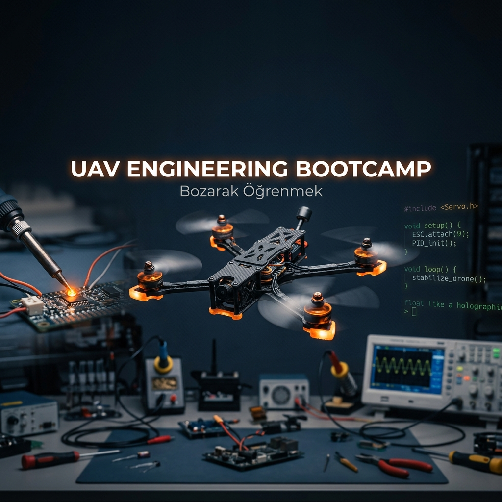

# UAV Engineering Bootcamp 🎓🚁

İnsansız Hava Araçları (İHA) mühendisliğini, karmaşık denklemlerden ve soyut akademik teorilerden arındırıp; tamamen sahaya, atölyeye ve pratik sistem entegrasyonuna odaklayan açık kaynaklı eğitim müfredatıdır.

Bu depo, modern otonom sistemlerin mimarisini sıfırdan anlamak, donanım seviyesinde lehim yaparak kendi platformunu toplamak ve uçuş kontrol yazılımlarının (Flight Stack) çekirdeğine inmek isteyenler için tasarlanmış kapsamlı bir rehberdir. Amacımız, sadece "kod yazan" değil, donanımın sınırlarını bilen ve sistemin fiziksel gerçeklikleriyle yüzleşebilen "mavi yaka" mühendislik yetkinliklerini kazandırmaktır.

## 📋 İçindekiler

1. [Kamp Felsefesi ve Yaklaşım](#-kamp-felsefesi-ve-yaklaşım)
2. [Eğitim Müfredatı (Aşamalar)](#-eğitim-müfredatı-aşamalar)
3. [Güvenlik ve Atölye Standartları](#-güvenlik-ve-atölye-standartları)
4. [Gerekli Ekipmanlar ve Atölye](#-gerekli-ekipmanlar-ve-atölye)
5. [Kaynaklar ve Okuma Listesi](#-kaynaklar-ve-okuma-listesi)
6. [Sınavlar ve Pratik Görevler](#-sınavlar-ve-pratik-görevler)
7. [Katkıda Bulunma ve Sertifikasyon](#-katkıda-bulunma-ve-sertifikasyon)
8. [Tüm Dosyalar ve İndeks](#-tüm-dosyalar)

---

## 🎯 Kamp Felsefesi ve Yaklaşım

Modern otonom sistemler eğitimi genellikle iki uca savrulur: Ya donanımdan tamamen kopuk salt yazılım simülasyonları ya da teorik arka planı olmayan ezbere dayalı montaj kılavuzları. Bu bootcamp, "Bozarak Öğrenmek" (Destructive Learning / Hands-on Deconstruction) felsefesini merkeze alır.

Bir sistemin nasıl çalıştığını anlamanın en kesin yolu, o sistemin limitlerini zorlamak, başarısız olduğu noktaları tespit etmek ve bu hatalardan mühendislik dersleri çıkarmaktır.

**Temel Prensiplerimiz:**
*   **Hata Bir Metriktir:** Yanmış bir ESC (Elektronik Hız Kontrolcü), güç dağıtım mimarisini anlamak için veri sayfalarından (datasheet) daha kalıcı bir derstir.
*   **Fizik Affetmez:** Yazılımdaki bir bug simülasyonda "Assertion Error" verirken, sahada fiziksel kırıma (crash) neden olur. Kodu yazarken yerçekimini ve eylemsizliği (inertia) hesaba katmak zorundasınız.
*   **Tamir Edemediğin Sistem Senin Değildir:** Eğer bir modülü sıfırdan kuramıyor ve arızalandığında multimetre ile kök neden analizi (Root Cause Analysis) yapamıyorsan, o sistemin hakimi değilsindir.

---

## 🛤️ Eğitim Müfredatı (Aşamalar)

Müfredat, ardışık bağımlılıklar üzerine kurulmuştur. Bir modülün kazanımları, bir sonrakinin önkoşuludur.

### Modül 1: Temeller ve Uçuş Fiziği (Aero 101)
Bu modül, aerodinamik prensiplerin otonom sistemlere nasıl uygulandığını inceler.
*   **Platform Analizi:** Multikopter, Sabit Kanat ve VTOL (Dikey İniş Kalkış) sistemlerinin görev profillerine göre karşılaştırmalı analizi.
*   **Vektörel Kuvvetler:** İtme (Thrust), Ağırlık, Taşıma (Lift) ve Sürüklenme (Drag) kuvvetlerinin dinamik dengesi.
*   **Tahrik Sistemleri:** Pervane hatvesi (pitch), çap hesaplamaları ve aerodinamik verimlilik (g/W) optimizasyonu.
*   **Motor Dinamikleri:** KV değerinin batarya voltajı ve pervane boyutu ile olan matematiksel ilişkisi.
→ **Detaylı İçerik:** [`moduls/01_aero.md`](moduls/01_aero.md)

### Modül 2: Elektronik ve Güç Sistemleri (Atölye 101)
İHA donanımının sinir sistemi ve enerji altyapısı bu modülde kurulur.
*   **Lehimleme Standartları:** Havacılık standartlarında (IPC-J-STD-001) soğuk lehimden arındırılmış, titreşime dayanıklı bağlantı teknikleri.
*   **Güç Analizi:** Multimetre kullanımı, kısa devre tespiti ve güç dağıtım (PDB) mimarisi.
*   **Enerji Depolama:** LiPo (Lityum Polimer) batarya kimyası, C-Rating deşarj kapasiteleri ve termal kaçak (thermal runaway) önleme prosedürleri.
*   **Fırçasız Motorlar:** BLDC çalışma prensipleri ve 3-fazlı AC tahrik sinyallerinin osiloskopik analizi.
→ **Detaylı İçerik:** [`moduls/02_electronics.md`](moduls/02_electronics.md)

### Modül 3: Uçuş Kontrolcüleri ve Sensörler (Sistem 101)
Otonom kararların alındığı mikrodenetleyici mimarisi ve algısal donanımlar incelenir.
*   **FC Mimarisi:** Modern Uçuş Kontrol Kartlarının (Flight Controller) işlemci yapısı ve G/Ç (I/O) portları.
*   **Ataletsel Ölçüm (IMU):** İvmeölçer ve Jiroskop verilerinin gürültü profilleri ve titreşim izolasyonunun önemi.
*   **Çevresel Algı:** Barometrik irtifa hesaplaması, Manyetometre (Pusula) kalibrasyonu ve GPS/GNSS sinyal kalitesi (HDOP/VDOP) analizi.
*   **Veri Yolları:** UART, I2C, SPI ve CAN Bus protokollerinin bant genişliği ve hata toleransı açısından karşılaştırılması.
→ **Detaylı İçerik:** [`moduls/03_fc_sensors.md`](moduls/03_fc_sensors.md)

### Modül 4: Yazılım ve Konfigürasyon (Soft 101)
Donanımın nasıl kontrol edileceği ve otonomi mantığının temelleri bu modülde atılır.
*   **Firmware Ekosistemi:** Betaflight (düşük gecikme/akrobasi), ArduPilot (tam otonomi/görev odaklı) ve PX4 (modüler/araştırma) sistemlerinin mimari analizi.
*   **Kontrol Teorisi (PID):** Oransal (Proportional), İntegral ve Türevsel (Derivative) döngülerin pratik uygulaması ve uçuş dinamiklerine etkisi.
*   **Hata Yönetimi (Failsafe):** İletişim kaybı durumlarında otonom hayatta kalma senaryoları (RTH, Land, Hold).
*   **SITL (Software-in-the-Loop):** Kodun sahadan önce simülasyon ortamında (Gazebo/RealFlight) doğrulanması.
→ **Detaylı İçerik:** [`moduls/04_software.md`](moduls/04_software.md)

### Modül 5: İlk Montaj ve Saha (Pratik 101)
Önceki tüm modüllerin fiziksel bir platformda birleştirilmesi ve saha operasyonları.
*   **Sistem Entegrasyonu:** 5 inç FPV veya F450 sınıfı bir şasi üzerinde sıfırdan elektromekanik montaj.
*   **EMI/RFI Koruması:** Elektromanyetik girişimi önleyecek kablo yönetimi ve sensör yerleşimi.
*   **Maiden Flight (İlk Uçuş):** Pre-flight (uçuş öncesi) kontrolleri, bench test prosedürleri ve güvenli kalkış protokolleri.
*   **Telemetri ve Log Analizi:** Uçuş sonrası BlackBox loglarının okunarak titreşim ve PID performansının değerlendirilmesi.
→ **Detaylı İçerik:** [`moduls/05_first_build.md`](moduls/05_first_build.md)

---

## 🛡️ Güvenlik ve Atölye Standartları

İnsansız Hava Araçları mühendisliği yüksek enerjili bataryalar ve yüksek devirli kesici pervaneler içerir. Güvenlik bir tercih değil, zorunluluktur.

1.  **Pervane Kuralı:** Masada, atölyede veya kapalı alanda batarya bağlanırken **pervaneler kesinlikle sökülü olmalıdır**. Yazılımsal bir hata, motorların aniden tam güçte çalışmasına neden olabilir.
2.  **Smoke Stopper Kullanımı:** Yeni bir montajda veya lehim işleminden sonra ilk güç her zaman bir kısa devre koruyucu (Smoke Stopper) üzerinden verilmelidir.
3.  **LiPo Güvenliği:** Lityum bataryalar darbe aldığında veya aşırı deşarj edildiğinde alev alabilir. Şarj işlemleri sadece yangına dayanıklı LiPo çantalarında ve gözetim altında yapılmalıdır.
4.  **Saha Disiplini:** İlk uçuşlar (Maiden) her zaman insanlardan ve yapılardan uzak, açık alanlarda gerçekleştirilmelidir. Arm işlemi öncesi çevrenin güvenli olduğu sesli olarak teyit edilmelidir.

---

## 🧰 Gerekli Ekipmanlar ve Atölye

Bu müfredatı uygulamak için laboratuvar standartlarında bir atölyeye ihtiyaç yoktur; ancak doğru ve güvenilir el aletleri şarttır. Kalitesiz ekipman, teşhisi zor donanımsal hatalara (hayalet arızalar) neden olur.

*   Isı ayarlı ve yüksek termal kapasiteli havya (örn. TS80P, TS100 veya muadili istasyonlar).
*   Kaliteli reçine çekirdekli (rosin-core) lehim teli ve sıvı/jel Flux.
*   Süreklilik testi (buzzer) yapabilen güvenilir bir dijital multimetre.
*   Metrik alyan seti, hassas cımbız ve kaliteli yan keski.
*   Zorunlu güvenlik ekipmanları: Smoke Stopper, LiPo Guard Çantası ve koruyucu gözlük.

Gerekli tüm malzemelerin güncel Türkiye piyasasına göre maliyet analizi ve platform seçenekleri için:
👉 **[`equipment_list.md`](equipment_list.md)**

---

## 📚 Kaynaklar ve Okuma Listesi

Gelişimin devamı için referans alınan küresel ve açık kaynaklı dökümantasyonlar:

*   **Sistem Entegrasyonu:** [ArduPilot Resmi Dokümantasyonu](https://ardupilot.org/)
*   **Uçuş Dinamikleri:** [Betaflight Wiki ve Tuning Rehberleri](https://github.com/betaflight/betaflight/wiki)
*   **Mimari ve ROS2:** [PX4 Developer Guide](https://docs.px4.io/main/en/)
*   **Pratik Sorun Giderme:** Joshua Bardwell ve Oscar Liang'ın teknik blog/video arşivleri.
*   **Teorik Kütüphane:** Kardeş depo olan [`uav-tech-manual`](https://github.com/arch-yunus/uav-tech-manual)
*   **Simülasyon:** Kardeş depo olan [`uav-mission-control`](https://github.com/arch-yunus/uav-mission-control)

---

## 🛠️ Sınavlar ve Pratik Görevler

Mühendislik yetkinliği çoktan seçmeli testlerle değil, çalışan donanımlarla kanıtlanır. Her modülün sonunda pratik bir mühendislik görevi bulunmaktadır.

| Görev Kodu | Modül | Kapsam | İstenen Çıktı |
| :--- | :--- | :--- | :--- |
| **Görev 1** | Modül 1 | İtki sisteminin matematiksel modeli | Pervane/Motor optimizasyon hesabı (`odevler/modul1/`) |
| **Görev 2-A** | Modül 2 | Yüksek akım hatlarının lehimlenmesi | PDB lehim fotoğrafları ve multimetre teyidi |
| **Görev 2-B** | Modül 2 | Enerji sisteminin karakterizasyonu | Batarya iç direnç ve hücre gerilim tablosu |
| **Görev 3** | Modül 3 | Sensör entegrasyonu | Telemetri logu (GPS Fix, 3D IMU doğrulaması) |
| **Görev 4** | Modül 4 | Yazılımsal döngü testi (SITL) | Simülasyon ortamında otonom waypoint uçuş logu |
| **Görev 5** | Modül 5 | Fiziksel doğrulama | Kapsamlı İlk Uçuş (Maiden Flight) Raporu |

Görev şablonlarına ulaşmak ve teslim formatını incelemek için `odevler/` dizinine bakınız.

---

## 🤝 Katkıda Bulunma ve Sertifikasyon

Bu repo, kolektif bir mühendislik hafızasıdır. Karşılaştığınız sıra dışı bir hata (bug), yaktığınız bir donanımın analizi veya müfredatta eksik gördüğünüz bir konu başlığı; açık kaynak topluluğu için paha biçilemezdir.

Özellikle sistem hatalarının kök neden analizlerini (Root Cause Analysis) içeren Pull Request'ler (PR) büyük takdirle karşılanır. Geliştirme süreçleri ve stil rehberi için lütfen [`CONTRIBUTING.md`](CONTRIBUTING.md) dosyasını inceleyiniz.

Müfredatı tamamlayan ve Görev 5'i (Maiden Flight Raporu) başarıyla teslim edip PR olarak onaylatan katılımcılar, temel seviye SUNGUR İHA Mühendislik yetkinliğini kanıtlamış sayılır.

---

## 📄 Lisans

Bu repo [MIT Lisansı](LICENSE) altındadır. Bilgiyi özgürce paylaşın, atölyenizi kurun ve gökyüzüne güvenli bir platform daha kazandırın.

---

## 🗂️ Tüm Dosyalar

| Dosya/Dizin | Açıklama |
| :--- | :--- |
| **[`QUICKSTART.md`](QUICKSTART.md)** | Müfredata en hızlı giriş noktası ve öğrenme haritası. |
| **[`equipment_list.md`](equipment_list.md)** | TR piyasasına uygun güncel ekipman ve maliyet analizi. |
| **[`SÖZLÜK.md`](SÖZLÜK.md)** | İHA mühendisliğine dair teknik kavramların A-Z açıklamaları. |
| **[`HATALOG.md`](HATALOG.md)** | Sahada ve atölyede en sık yapılan hatalar ve çıkarılan dersler. |
| **[`moduls/01_aero.md`](moduls/01_aero.md)** | Modül 1: Uçuş Fiziği, Kuvvetler, Aerodinamik Temeller. |
| **[`moduls/02_electronics.md`](moduls/02_electronics.md)** | Modül 2: Elektronik, Güç Dağıtımı, Havya ve LiPo Güvenliği. |
| **[`moduls/03_fc_sensors.md`](moduls/03_fc_sensors.md)** | Modül 3: Uçuş Kontrolcü Mimarisi ve Çevresel Algı Sensörleri. |
| **[`moduls/04_software.md`](moduls/04_software.md)** | Modül 4: Firmware Yönetimi, Kontrol Teorisi (PID) ve SITL. |
| **[`moduls/05_first_build.md`](moduls/05_first_build.md)** | Modül 5: Sistem Entegrasyonu, Montaj Prosedürü ve Uçuş Testi. |
| **[`odevler/`](odevler/)** | Pratik görevlerin ve değerlendirme şablonlarının bulunduğu dizin. |
| **[`scripts/sitl_quickstart.sh`](scripts/sitl_quickstart.sh)** | Simülasyon ortamını (SITL) hızlıca başlatan otomasyon betiği. |
| **[`src/gnc/pid_controller.hpp`](src/gnc/pid_controller.hpp)** | Endüstriyel sınıf PID algoritmasının detaylı ve açıklamalı kaynak kodu. |
| **[`CONTRIBUTING.md`](CONTRIBUTING.md)** | Açık kaynak topluluğuna katkı sağlama ve kod yazım standartları rehberi. |