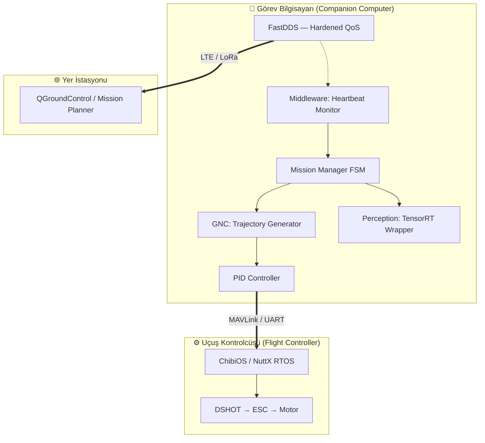

<div align="center">


# 🛸 SUNGUR | İHA Yazılım Mühendisliği Lab'ı

**Açık Kaynaklı · Türkçe · Sıfırdan İleri Seviyeye**

[](https://github.com/arch-yunus/uav-systems-architecture)
[](https://docs.ros.org/en/humble/)
[](https://developer.nvidia.com/tensorrt)
[](https://github.com/arch-yunus/uav-systems-architecture)
[](LICENSE)

> *"Gerçek bir mühendis kodu ezberlemez — sistemin fiziğini kodlar."*

</div>

---

## 🎯 Bu Repo Kimin İçin?

Bu depo, **SUNGUR İHA Mühendisliği Akademisi**'nin **Yazılım Lab'ı**dır.

Uçuş kontrol yazılımlarını, GNC algoritmalarını ve yapay zeka tabanlı algı sistemlerini **gerçek kod üzerinde**, **adım adım** öğrenmek isteyen herkes için hazırlanmıştır.

| Hedef Kitle | Bu Repodan Ne Öğreneceksiniz? |
| :--- | :--- |
| 🔰 **Başlangıç** | ROS2 kurulumu, düğüm yazma, topic/service kavramları |
| 🔧 **Orta Seviye** | PID kontrolü, trajectory planlama, MAVLink köprüsü |
| 💻 **İleri Seviye** | TensorRT ile Edge AI, SLAM entegrasyonu, DDS middleware |
| 🧠 **Uzman** | Sistem tasarımı, açık kaynak katkısı, sertifikasyon |

> 📚 **Teorik Altyapı:** Aerodinamik, donanım ve regülasyon bilgisi için → [`uav-tech-manual`](https://github.com/arch-yunus/uav-tech-manual)
> 🎮 **Pratik Simülatör:** Uçuş ve arıza pratiği için → [`uav-mission-control`](https://github.com/arch-yunus/uav-mission-control)

---

## 🗺️ Öğrenme Yolu

```
🔰 KURULUM           🔧 KONTROL           💻 ALGI              🧠 SİSTEM
──────────           ──────────           ──────────           ──────────
ROS2 Temelleri  →   PID Algoritmaları → Edge AI / TensorRT → Sistem Tasarımı
Node & Topic         Trajectory Gen.      SLAM & Haritalama    LCHI Mimarisi
MAVLink Bridge       Failsafe Mantığı     Sensor Füzyonu       Açık Kaynak Katk.
```

### 📖 Lab Rehberleri

| # | Lab | Konu | Kaynak Dosya |
| :- | :--- | :--- | :--- |
| 01 | [ROS2 Temelleri](docs/LAB_01_ROS2_BASICS.md) | Node, Topic, Service, Launch | `src/gnc/sovereign_gnc_node.cpp` |
| 02 | [PID Kontrolü](docs/LAB_02_PID_TUNING.md) | Ziegler-Nichols, Anti-windup, SITL testi | `src/gnc/pid_controller.hpp` |
| 03 | [Edge AI & TensorRT](docs/LAB_03_EDGE_AI.md) | Model optimizasyon, Inference pipeline | `src/perception/tensorrt_wrapper.py` |

---

## 🏗️ Yazılım Mimarisi

Bu lab'da inceleyeceğiniz sistemin katmanlı mimarisi:



### Kaynak Kod Haritası

```
src/
├── gnc/
│   ├── sovereign_gnc_node.cpp    ← Ana GNC düğümü (Lab 01'de inceleniyor)
│   ├── pid_controller.hpp        ← Endüstriyel PID kütüphanesi (Lab 02)
│   └── trajectory_generator.cpp  ← Rota planlama düğümü
├── perception/
│   ├── target_perception_node.py ← ROS2 vision pipeline
│   └── tensorrt_wrapper.py       ← TensorRT inference motoru (Lab 03)
├── middleware/
│   └── heartbeat_monitor.py      ← CC↔FC link sağlık izleyicisi
└── mission/
    └── mission_manager.cpp       ← Görev durum makinesi (FSM)
```

---

## ⚙️ Kurulum

### Ön Koşullar
- Ubuntu 22.04 LTS
- ROS2 Humble
- Python 3.10+
- (Opsiyonel) NVIDIA Jetson / Orin — Edge AI dersleri için

### Hızlı Kurulum

```bash
# 1. Repoyu klonla
git clone https://github.com/arch-yunus/uav-systems-architecture.git
cd uav-systems-architecture

# 2. Otomatik kurulum (ROS2, MAVROS, OpenCV)
chmod +x scripts/bootstrap.sh
./scripts/bootstrap.sh --install-all

# 3. Paketi derle
cd ~/ros2_ws
colcon build --packages-select sungur_architecture
source install/setup.bash
```

### Docker ile Başlat

```bash
# Tüm geliştirme ortamını kap içinde çalıştır
docker-compose up -d

# Tüm SUNGUR stack'ini başlat
ros2 launch sungur_architecture sovereign_launch.py
```

---

## 🧪 Yazılım Yığını (Tech Stack)

| Katman | Teknoloji | Öğrenme Kaynağı |
| :--- | :--- | :--- |
| **Uygulama** | ROS2 Humble / Iron, Behavior Trees | [Lab 01](docs/LAB_01_ROS2_BASICS.md) |
| **Kontrol** | C++ PID, Trajectory Generator | [Lab 02](docs/LAB_02_PID_TUNING.md) |
| **Algı** | Python, TensorRT, CvBridge | [Lab 03](docs/LAB_03_EDGE_AI.md) |
| **Middleware** | FastDDS, micro-ROS, MAVLink 2.0 | [MAVLINK_DDS_BRIDGE.md](docs/MAVLINK_DDS_BRIDGE.md) |
| **Simülasyon** | ArduPilot SITL, Gazebo (Harmonic) | [Lab 02](docs/LAB_02_PID_TUNING.md) |
| **Konteyner** | Docker, docker-compose | [docker/Dockerfile](docker/Dockerfile) |
| **CI/CD** | GitHub Actions | [.github/workflows/](.github/workflows/) |

---

## 🎓 8 Haftalık Müfredat

Tam müfredat ve haftalık ders planı için → **[CURRICULUM.md](CURRICULUM.md)**

```
Hafta 1–2: İHA Anatomisi + Uçuş Hukuku (Teori)
Hafta 3–4: Bakım, Görev Planlama, Simülatör Pratiği
Hafta 5–6: ROS2 + PID Kontrolü (Bu Repo)
Hafta 7–8: Edge AI + Sistem Mimarisi + Katkı
```

---

## 🤝 Akademiye Katkıda Bulun

Tam katkı rehberi → **[CONTRIBUTING.md](CONTRIBUTING.md)**

```bash
# Fork → Branch aç → Değişiklik yap → PR gönder
git checkout -b feature/lab-04-slam-basics
```

Merge edilen PR'lar **sertifikasyon** sürecinde "Açık Kaynak Katkısı" olarak sayılır.

---

<div align="center">

**[📚 Teorik Kütüphane](https://github.com/arch-yunus/uav-tech-manual)** · **[🎮 Simülatör](https://github.com/arch-yunus/uav-mission-control)** · **[🗺️ Müfredat](CURRICULUM.md)**

*SUNGUR İHA Mühendisliği Akademisi — Bilgi paylaşıldıkça, İHA'lar yükseldikçe özgürleşir.* ⚔️

</div>