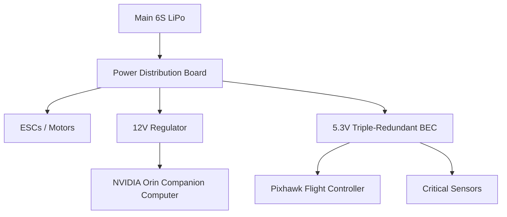

# 🔋 Smart Power Management & BMS Integration

Safe and intelligent power distribution is vital for long-endurance autonomous missions.

## 1. Power Distribution Network (PDN)
The PDN is designed to isolate sensitive avionics from high-current propulsion surges.

## 2. Smart BMS Communication
The system communicates with the battery over **SMBus/I2C** to retrieve:
- Individual cell voltages.
- Discharge current (Amps).
- Remaining Capacity (mAh).
- Battery Temperature.

## 3. Failsafe Thresholds
| Level | Voltage (per cell) | Action |
| :--- | :--- | :--- |
| **Nominal** | 3.7V - 4.2V | Normal Ops |
| **Low** | 3.5V | Warning & RTL Suggested |
| **Critical** | 3.4V | Automatic Land at current location |
