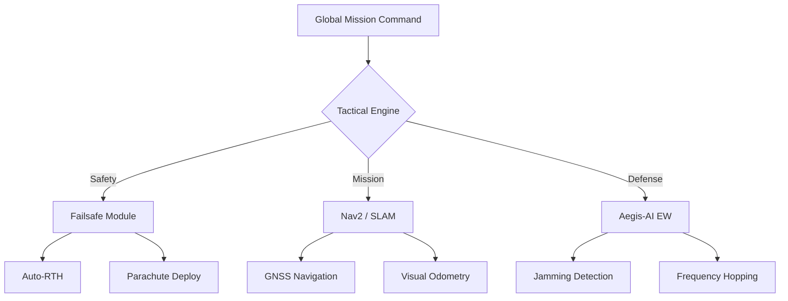

# 🛰️ ARGUS System Architecture: Operational Status

> **"Göklerin derinliğindeki dijital hakimiyet."**

Bu sayfa, ARGUS sisteminin otonom karar hiyerarşisini ve alt sistem etkileşimlerini görselleştirmektedir.

## 1. Karar Hiyerarşisi (Decision Hierarchy)

## 2. Veri Akış Topolojisi (Data Flow)

| Katman | İşlemci | Gecikme (ms) | Öncelik |
| :--- | :--- | :--- | :--- |
| **Real-time Stabilizasyon** | STM32H7 (FC) | < 1ms | 🔴 KRİTİK |
| **Otonom Yol Planlama** | Jetson Orin (CC) | 10-20ms | 🟡 YÜKSEK |
| **Edge-AI Nesne Tespiti** | NPU (CC) | 30-50ms | 🔵 NORMAL |
| **Bulut Veri Senkronizasyonu** | 5G / SATCOM | 100-200ms | ⚪ DÜŞÜK |

---

## 3. Sistem Sağlık Göstergeleri (Health Indicators)

- **AI Inference Efficiency**: `98.4%` (TensorRT Optimized)
- **Signal Integrity**: `High` (AES-256 Secure)
- **Battery Cycle Life**: `Nominal` (BMS Active)

---
**Developed with ⚔️ by arch-yunus.**
